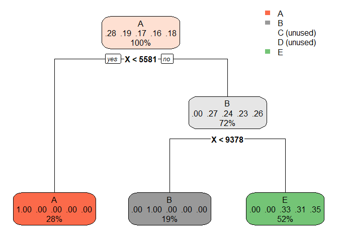
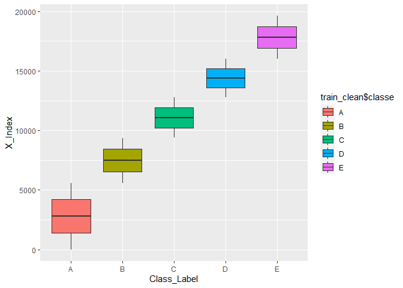
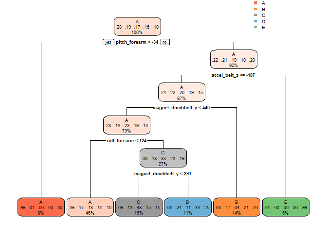

Practical Machine Learning - Course Project: Prediction Lifting Exercise
========================================================================

RB,  
02.04.2021

    library(data.table)
    library(readr)
    library(dplyr)
    library(tidyr)
    library(ggplot2)
    library(lattice)
    library(knitr)
    library(rmarkdown)

I. Load training and test data set
----------------------------------

The data for this project come from the Human Activity Recognition
project: *Ugulino, W.; Cardador, D.; Vega, K.; Velloso, E.; Milidiu, R.;
Fuks, H. Wearable Computing: Accelerometers’ Data Classification of Body
Postures and Movements. Proceedings of 21st Brazilian Symposium on
Artificial Intelligence. Advances in Artificial Intelligence - SBIA
2012.*

*Excercise: Prediction of body movements based on the measured
accelerometer-sensor data*

    train <- read.csv("train/pml-training.csv", sep = ",", dec = ".")
    test  <- read.csv("test/pml-testing.csv", sep = ",", dec = ".")

II. Explaratory Data Analyis and cleaning data
----------------------------------------------

1.  What is the structure of the data - number of variables and
    observations?

<!-- -->

    dim(train)

    ## [1] 19622   160

1.  Removing unnecessary variables/columns which mostly consists NAs.

Firstly, removing na-columns and columns with little variation.

    library(caret)
    train_clean <- train[,colMeans(is.na(train)) < .95] # filter out na-columns (with mainly Nas)
    train_clean <- train_clean[,-nearZeroVar(train_clean)] # filter out variables with near zero variance
    dim(train_clean)

    ## [1] 19622    59

To have a first look at the data use a simple decision tree:

    library(rpart)
    library(rpart.plot)
    model_rpart<- train(classe ~ ., method = "rpart", data = train_clean)
    rpart.plot(model_rpart$finalModel)

    model_rpart

    ## CART 
    ## 
    ## 19622 samples
    ##    58 predictor
    ##     5 classes: 'A', 'B', 'C', 'D', 'E' 
    ## 
    ## No pre-processing
    ## Resampling: Bootstrapped (25 reps) 
    ## Summary of sample sizes: 19622, 19622, 19622, 19622, 19622, 19622, ... 
    ## Resampling results across tuning parameters:
    ## 
    ##   cp         Accuracy   Kappa    
    ##   0.2436975  0.7514270  0.6841405
    ##   0.2568722  0.5658447  0.4455208
    ##   0.2704031  0.3840587  0.1718228
    ## 
    ## Accuracy was used to select the optimal model using the largest value.
    ## The final value used for the model was cp = 0.2436975.

Looks like the data is pre-ordered by the variable X. This result is
confirmed by plotting the X variable against the class-label which shows
that they are highly correlated.

    qplot(train_clean$classe, train_clean$X, xlab = "Class_Label" , ylab = "X_Index",  geom="boxplot", fill = train_clean$classe)

Therefore columns consisting metadata (spurious correlations/order in
the data) should be removed as prediction should be based only on
*measured sensor data*.

    train_clean <- train_clean[,-c(1:7)] # filter out metadata
    dim(train_clean)

    ## [1] 19622    52

    model_rpart<- train(classe ~ ., method = "rpart", data = train_clean)
    rpart.plot(model_rpart$finalModel)

    model_rpart

    ## CART 
    ## 
    ## 19622 samples
    ##    51 predictor
    ##     5 classes: 'A', 'B', 'C', 'D', 'E' 
    ## 
    ## No pre-processing
    ## Resampling: Bootstrapped (25 reps) 
    ## Summary of sample sizes: 19622, 19622, 19622, 19622, 19622, 19622, ... 
    ## Resampling results across tuning parameters:
    ## 
    ##   cp          Accuracy   Kappa    
    ##   0.02983905  0.5170578  0.3787343
    ##   0.03567868  0.4669097  0.3020789
    ##   0.06318544  0.3563091  0.1191227
    ## 
    ## Accuracy was used to select the optimal model using the largest value.
    ## The final value used for the model was cp = 0.02983905.

Removing the X-variable was the right decision as can be seen from the
updated rpart model.

III. Model building and training: Random Forest
-----------------------------------------------

For this classification excercise we will use Random Forest as the
classification model (“wisdom of the crowd”) as it is expected to
predict better than a simple decision tree model (encountered with
over-fitting).

    set.seed(1234)

To accelerate computation use the parallel mode of the caret package:

    library(foreach)
    library(iterators)
    library(parallel)
    library(doParallel)

    cluster <- makeCluster(detectCores() - 1) # one core is left for the operating system
    registerDoParallel(cluster)
    train_param <- trainControl(method = "cv", number = 5, allowParallel = TRUE)
    RandomForest <- train(classe ~., method = "rf", ntree = 501, trControl = train_param, data = train_clean) # mtry should be sqrt(number of random variables used for each node in each tree)
    # ntree number of bootstrap replicates
    ## close parallel mode 
    stopCluster(cluster)
    registerDoSEQ()

**Results**: Confusion matrix and estimated out of back error rate of
the random forest model using five-fold cross validation and an 501
trees (odd number) to break ties.

    RandomForest$finalModel

    ## 
    ## Call:
    ##  randomForest(x = x, y = y, ntree = 501, mtry = param$mtry) 
    ##                Type of random forest: classification
    ##                      Number of trees: 501
    ## No. of variables tried at each split: 26
    ## 
    ##         OOB estimate of  error rate: 0.44%
    ## Confusion matrix:
    ##      A    B    C    D    E  class.error
    ## A 5576    3    0    0    1 0.0007168459
    ## B   20 3768    7    1    1 0.0076376086
    ## C    0   11 3403    8    0 0.0055523086
    ## D    0    0   21 3192    3 0.0074626866
    ## E    0    0    4    6 3597 0.0027723870

IV. Prediction of random forest on test data sets
-------------------------------------------------

To answer the quiz the trained random forest model is used to predict
the 5 classes (A, B, C, D, and E) for the 20 test cases. Note the
trained random forest model is tested with the test data sets which are
similarly pre-processed as the training sets and without pre-processing
yielding the same classification results.

    test_clean <- test[,colMeans(is.na(test)) < .95] # filter out na-columns
    test_clean <- test_clean[,-c(1:7)] # filter out  metadata - should be irrelevant for the prediction
    dim(test_clean)

    ## [1] 20 53

    prediction_clean <- predict(RandomForest, test_clean)
    prediction       <- predict(RandomForest, test)
    print(prediction_clean)

    ##  [1] B A B A A E D B A A B C B A E E A B B B
    ## Levels: A B C D E

    print(prediction)

    ##  [1] B A B A A E D B A A B C B A E E A B B B
    ## Levels: A B C D E
